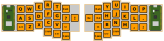

# cs489-keyboard

A handwired keyboard close to a corne, with heavy inspiration and models used from [Joe-Scotto's](https://github.com/joe-scotto/scottokeebs) [Scotto44](https://github.com/joe-scotto/scottokeebs/tree/main/Scotto44).

We used Arduino IDE and the Arduino keyboard coding library.

This is a group project for Purdue's CS489 class in Fall of 2025.
